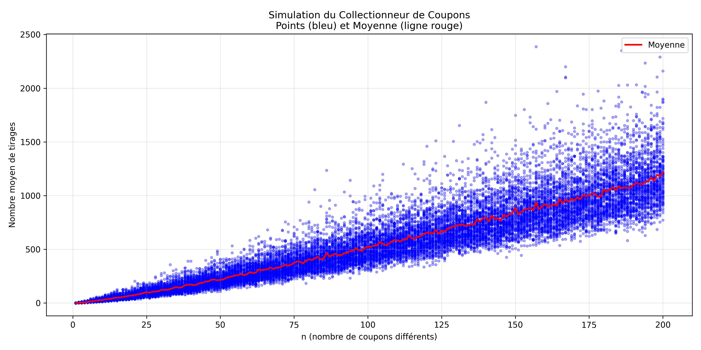
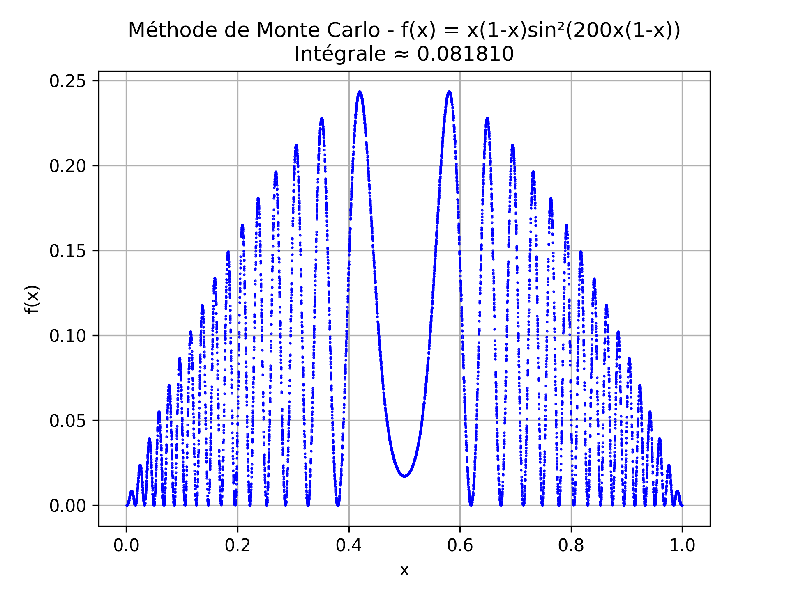

#salas oukil M1_sic_ido
# algorithmes robabilistes inegalites
[github](https://github.com/codhsalas/algorithmes_probabilistes_inegalites)

pour  la visulisation des resultats de la simulation on remarque que les se regroup au tours d'un moyen avec de tres rare cas ou ca s'eloigne de la moyen

## Méthode de Monte-Carlo

### Résultats obtenus

#### Intégrales des fonctions boîtes noires

| Fonction | Domaine d'intégration | Résultat |
|----------|----------------------| ----------|
| fonction1 | [0, 1] | 2.527 |
| fonction2 | [0, √3] | 1.814 |
| fonction3 | [1, 3] × [-2, 1] | 6.013 |
| fonction4 | [1, 2] × [-2, 1] × [2, 6] | -150.191 |

### Fonction avec visualisation

**f(x) = x(1-x)sin²(200x(1-x))** sur [0, 1]

**Intégrale approximée : 0.0818**

---

## Analyse des résultats

### 1. fonction1 sur [0, 1]
- **Résultat : 2.527**
- **Interprétation** : La valeur moyenne de fonction1 sur [0, 1] est d'environ 2.527
- Cette valeur est relativement élevée par rapport à la taille du domaine (longueur = 1)
- La fonction semble prendre des valeurs importantes sur cet intervalle

### 2. fonction2 sur [0, √3]
- **Résultat : 1.814**
- **Domaine : √3 ≈ 1.732**
- **Valeur moyenne : 1.814 / 1.732 ≈ 1.047**
- La fonction a une valeur moyenne proche de 1 sur ce domaine

### 3. fonction3 sur [1, 3] × [-2, 1]
- **Résultat : 6.013**
- **Surface du domaine : 4**
- **Valeur moyenne : 6.013 / 4 ≈ 1.503**
- Fonction 2D avec une valeur moyenne modérée et positive

### 4. fonction4 sur [1, 2] × [-2, 1] × [2, 6]
- **Résultat : -150.191**
- **Volume du domaine : 12**
- **Valeur moyenne : -150.191 / 12 ≈ -12.516**
- **Résultat négatif important** : la fonction prend majoritairement des valeurs négatives
- La valeur moyenne fortement négative suggère que fonction4 est systématiquement négative ou a des valeurs négatives très prononcées sur ce domaine 3D

### 5. Fonction oscillante f(x) = x(1-x)sin²(200x(1-x))
- **Résultat : 0.0818**
- **Interprétation** : Malgré les oscillations rapides (fréquence 200), l'intégrale est relativement petite
- Le terme x(1-x) crée une enveloppe parabolique qui s'annule aux bords [0 et 1]
- Le terme sin²(200x(1-x)) oscille très rapidement, créant de nombreux pics et creux
- La visualisation montre un nuage de points dense illustrant ces oscillations
- Les oscillations se compensent partiellement, d'où une intégrale modeste

---

## Observations

### Précision de la méthode
La méthode de Monte-Carlo converge avec une erreur de l'ordre de **1/√N** où N est le nombre de tirages.

Pour N = 100 000 tirages :
- Erreur standard ≈ 1/√100000 ≈ 0.003 (0.3%)

### Fiabilité des résultats
**Résultats cohérents** : Les ordres de grandeur semblent plausibles
**fonction4 négative** : Cas particulier mais mathématiquement valide
**Fonction oscillante** : Résultat faible cohérent avec les compensations d'oscillations

### Amélioration possible
Pour augmenter la précision :
- Augmenter le nombre de tirages (N = 1 000 000 par exemple)
- Répéter les calculs plusieurs fois et calculer la moyenne
- Calculer l'écart-type des estimations pour évaluer la précision

---

## Conclusion

La méthode de Monte-Carlo a permis d'approximer efficacement les intégrales de fonctions "boîtes noires" sans connaître leur expression analytique. Les résultats montrent la diversité des comportements possibles :
- Fonctions positives avec différentes intensités (fonction1, 2, 3)
- Fonction fortement négative (fonction4)
- Fonction oscillante avec compensation (fonction visualisée)

Cette méthode est particulièrement puissante pour les intégrales multidimensionnelles (fonction4 en 3D) où les méthodes classiques deviennent complexes.

bt visualisation

